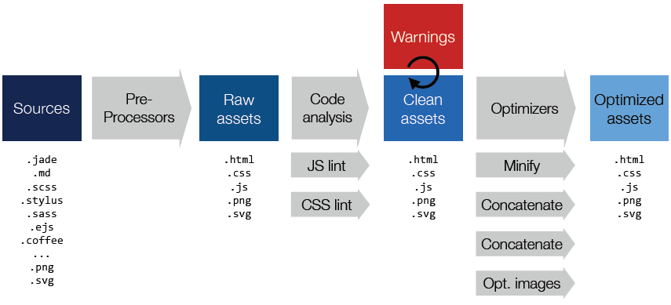
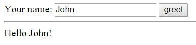
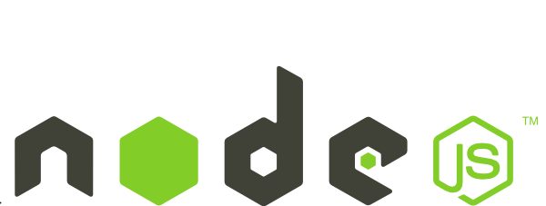
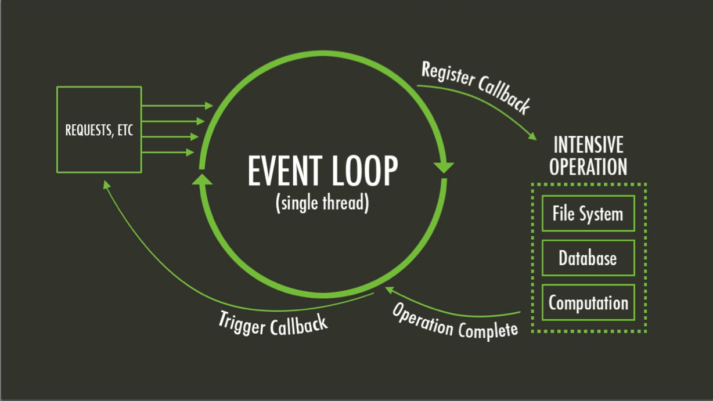
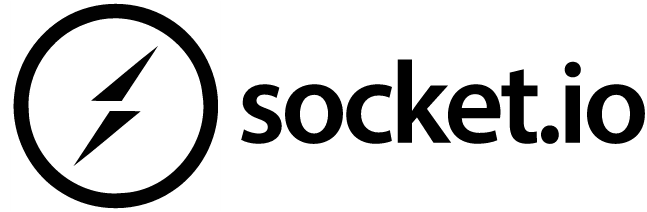
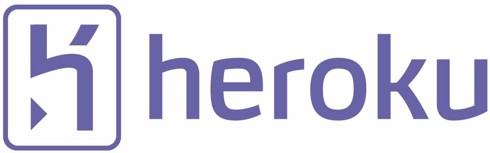
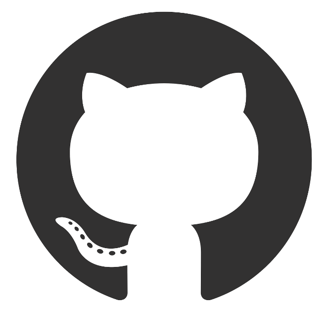

# Technical Documentation

This document aims to present to a developer what tools and frameworks were used in order to deliver the project as it is. 

Firstly, we will go through the process in which we created the skeleton of the project using a generator. We will explain how the generator works and what it brings *out-of-the-box*.

Secondly, we will talk about the frameworks and technologies used in order to develop our functionalities.

## Table of Contents

* **[Scaffolding](#technologies-used-to-build-the-project-aka-scaffolding)**
	* **[Yeoman](#yeoman-)**   
	* **[Angular-Fullstack](#angular-fullstack)**
	* **[Grunt](#grunt-)**
	* **[Bower and NPM](#bower--and-node-package-manager-npm-)**  
* **[Development](#technologies-used-in-the-project-aka-development)**
	* **[Javascript](#javascript-)**
	* **[AngularJS](#angularjs-)**
		* *[Model-View-Controller](#model-view-controller-mvc)*
		* *[Scope](#scope)*
		* *[Dependency Injection](#dependency-injection)*
	* **[Node.js](#nodejs-)** 
		* *[Event Loop](#event-loop)*
	* **[Socket.io](#socketio-)** 
	* **[Persistence](#persistence-mongodb-)** 
		* *[Mongoose](#mongoose)*
	* **[Amazon S3](#amazon-s3-)** 
	* **[Heroku](#heroku-)** 
	* **[GitHub](#github-)** 

## Technologies used to build the project aka Scaffolding

In this section, we will describe the tools we used to create and work on the project.

### [Yeoman](http://yeoman.io/) 

Yeoman is a scaffolding tool. In other words, it helps us to create a base for a new project. It uses different generators (working as plug-in) to make a skeleton that already contains things like users management, REST API and client interface, depending on the chosen generator. In this project, we used the Angular-Fullstack generator.

### [Angular-Fullstack](https://github.com/DaftMonk/generator-angular-fullstack)

(Schemas under this section comes from the official angular-fullstack page on github : https://github.com/DaftMonk/generator-angular-fullstack)

This is one of the generators that Yeoman can use. By typing `yo angular-fullstack [app-name]` in the command prompt, you will create a new project that looks like this:

    ├── client
    │   ├── app                 - All of our app specific components go in here
    │   ├── assets              - Custom assets: fonts, images, etc…
    │   ├── components          - Our reusable components, non-specific to to our app
    │
    ├── e2e                     - Our protractor end to end tests
    │
    └── server
        ├── api                 - Our apps server api
        ├── auth                - For handling authentication with different auth strategies
        ├── components          - Our reusable or app-wide components
        ├── config              - Where we do the bulk of our apps configuration
        │   └── local.env.js    - Keep our environment variables out of source control
        │   └── environment     - Configuration specific to the node environment
        └── views               - Server rendered views

On the client side, we can see that there already is an “app” section. This section contains the project specific components for the client. Here you can see an example of directory content under the client/app section:

    main
    ├── main.js                 - Routes
    ├── main.controller.js      - Controller for our main route
    ├── main.controller.spec.js - Test
    ├── main.html               - View
    └── main.less               - Styles

You can generate a new route by typing the command `yo angular-fullstack:route [route-name]`.

On the server side, there is an “api” section. This section contains a functional REST API and each directory is a different endpoint. Here you can see an example of directory content under the server/api section:

    thing
    ├── index.js                - Routes
    ├── thing.controller.js     - Controller for our `thing` endpoint
    ├── thing.model.js          - Database model
    ├── thing.socket.js         - Register socket events
    └── thing.spec.js           - Test
    
You can generate a new endpoint by typing the command `yo angular-fullstack:endpoint [endpoint-name]`.

Those endpoints already have a link to a persistence layer like MongoDB in our case.

### [Grunt](http://gruntjs.com/) 

This is a task runner, in other words, it automates all the building tasks in order to save time and/or prevent manual buildings errors. In addition, we can make live changes in our code while grunt is running and it will update the projects build accordingly. So, if we make a change in our code, we can see it in “live” and we don’t have to use any commands to test the new changes in our project.

Grunt in itself performs several tasks like minifying and testing the application’s code before running it. Here you can see the Grunt’s build pipeline:

### [Bower](http://bower.io/)  and [Node Package Manager (NPM)](https://www.npmjs.com/) 

Both of them are package managers. Those tools are made automate the process of installing, upgrading, configuring and removing packages.

In other words, typing a command like `bower install jquery` will download a jquery package which contains all the needed files to use jquery in a project. The installation in itself isn’t really helpful, since it’s not hard to download something manually on a website, what is interesting is that we can automatically upgrade an old package just by typing a command like `bower update jquery`.

## Technologies used in the project aka Development

In this chapter, we will present all the technologies that are used around the project. That means, what we had to learn in order to use and deploy efficiently our project.

### [Javascript](http://www.w3schools.com/js/) 

Javascript is a dynamic programming language mostly used in web applications. Its implementation allows client-side scripts to interact with the user, control the browser, communicate asynchronously and alter the content that is displayed.

We used Javascript coupled with AngularJS for every aspect of our application.

### [AngularJS](https://angularjs.org/) 

AngularJS is a framework for Javascript adding a whole dynamic environment to HTML page declaration.

#### Model-View-Controller (MVC)

AngularJS is based on the MVC design pattern. The pattern allows to separate concerns in the logic of the application.

The different components are managed by the controller, which associates a scope and different sub-scopes which are executions contexts for expressions.

#### Scope

The Angular scope works for 2-way data binding. Any expression declared in the controller is accessible by the view using the double brackets notation `{{}}`. The way works with the Angular directives declared in the view. We will take the example with an ng-model directive attached to a text box:

	

	  Your name:
	    <input type="text" ng-model="username">
	    <button ng-click='sayHello()'>greet</button>
	  

	  {{greeting}}
	

As we can see, the input form is attached to "username" which content will be added to the scope. In the controller we have the following code:

	angular.module('scopeExample', [])
	.controller('MyController', ['$scope', function($scope) {
	  $scope.username = '';
	
	  $scope.sayHello = function() {
	    $scope.greeting = 'Hello ' + $scope.username + '!';
	  };
	}]);

When we click the "greet" button, the function `sayHello()` will be called and the `$scope.greeting` field will be updated in the controller, thus updating the `{{greeting}}` field in the DOM.

Result:

#### Dependency injection

Angular services are accessible through dependency injection in the controller. There are several ways to declare a dependency in an Angular controller but throughout the project we mostly used implicit annotation:

	someModule.controller('MyController', function($scope, myDependency) {
	  // ...
	});

Several services are provided by Angular, such as `$http` that handles common operations in web apps, but the user can specify his own services using a **service factory function**.

By using an implicit annotation, the injector will look for a service with a matching name:

### [Node.js](http://nodejs.org/) 

Node.js is a server-side runtime environment based on an event-driven architecture. It provides a non-blocking I/O API that optimized an application throughput and scalability. It is mostly used for real-time web applications.

It used several times in our implementation :

 * Environment configuration on the server side : in the `server/config/environment/` folder. It configures the communication with the database and how the users are managed.
 *  Authentication : the node middleware also manages authentication of users when required. The generator provides OAuth support with several services such as Facebook, Twitter and Google+ but we didn't use these.

#### Event Loop

Node.js is single threaded but uses what we call an *event loop* to perform asynchronous I/O operations. Every I/O uses a callback that doesn't interrupt the code. As the cost of an I/O can vary and sometimes be extremely long, this assures that things still run smoothly. 

So how does this *event loop* work ?

Javascript runtimes contain a message queue which stores a list of messages to be processed and their associated callback functions. These messages are queued in response to external events (such as a mouse being clicked or receiving the response to an HTTP request) given a callback function has been provided. If, for example a user were to click a button and no callback function was provided – no message would have been enqueued.

In a loop, the queue is polled for the next message (each poll referred to as a “tick”) and when a message is encountered, the callback for that message is executed.

(Source: http://blog.carbonfive.com/2013/10/27/the-javascript-event-loop-explained/)

### [Socket.io](http://socket.io/) 

Socket.io is a library allowing to do a very simple real-time communication using several techniques. The most used is [WebSocket](http://en.wikipedia.org/wiki/WebSocket) but Socket.io can fallback to others techniques when needed.

WebSocket opens a dual channel between the client and the server allowing the server itself to send messages to the client without necessarily having been polled prior.

The code is divided into two parts :

 * Server side : The server accepts messages and connections and the associated behavior is executed
	
		// Load socket.io
		var io = require('socket.io').listen(server);
		
		// When a client connects, we can send a confirmation through a message
		io.sockets.on('connection', function (socket) {
		    socket.emit('message', 'You are now connected !');
		});

 * Client side : 
	 
		// Connection to the server
		var socket = io.connect('http://localhost:8080');
		
		// The client receives a message from the server
		socket.on('message', function(message) {
		    alert('The server sent : ' + message);
		})

Of course, the advantage of Socket.io is to be able broadcast to multiple clients. This is achieved by using :

	socket.on('message', function (message) {
			socket.broadcast.emit('message', message);
	});

The type of communication is used in our application for different purposes. The chat was built using this library, the synchronization of page changes between a teachers and the students as well and finally the reception of real-time feedback by the teacher.

Every message, page change or feedback that is sent is persisted in a database for coherence as well as subsequent access.

### Persistence ([MongoDB](http://www.mongodb.org/)) 

MongoDB is a document-oriented database (referred to as a NoSQL database). It manages JSON-like objects with dynamic schemas allowing an easier and faster management of data compared to traditional relational databases.

MongoDB aggregates data under the form of *collections* of similar objects which can then be retrieved easily through simple queries.

Within the context of our project, we manipulate JSON data that can be persisted through MongoDB and accessible through REST calls to the API.

#### [Mongoose](http://mongoosejs.com/)

Our project is written in Javascript and Mongoose is a plug-in used with Node.js which allows us to easily perform CRUD operations on our database. The Angular-Fullstack generator delivers us a fully functional architecture with a connection to a database and a very simple generation of collections through the creation of API *endpoints*.

On top of that, we can use AngularJS directives such as `$http.get()` and `$http.post()` that use Mongoose as middleware to perform CRUD operations.

### [Amazon S3](http://aws.amazon.com/s3/) 

Amazon S3 (Simple Storage Service) is one of the tools provided by Amazon Web Services (AWS) which offers a secure storage space on the cloud. We suggest to use this platform to upload and access PDF documents because the user can manually activate [CORS](http://en.wikipedia.org/wiki/Cross-origin_resource_sharing) which allows our application to data stored in remote locations.

### [Heroku](https://www.heroku.com) 

Heroku is a cloud platform as a service (PaaS). It supports Node.js among other programming languages. It lets developers deploy and host applications through git.

We use this service to host our application on the web and making it publicly accessible.

### [GitHub](https://github.com/) 

GitHub is web-based [Git](http://git-scm.com/) repository service. Git is a version control system designed to  efficiently handle collaborative projects.

Our whole project is open-source and accessible through GitHub [here](https://github.com/EvilAngel00/TWEB-Project01).

## Sequence diagram
Fréd & Rui
What happens when you click on "Next" in a slide ?

