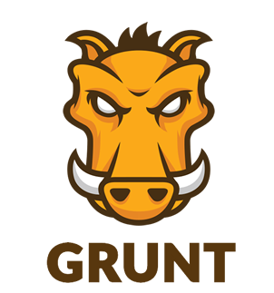

# Technical Documentation

This document aims to present to a developer what tools and frameworks were used in order to deliver the project as it is. 

Firstly, we will go through the process in which we created the skeleton of the project using a generator. We will explain how the generator works and what it brings *out-of-the-box*.

Secondly, we will talk about the frameworks and technologies used in order to develop our functionalities.

## Technologies used to build the project aka Scaffolding

In this section, we will describe the tools we used to create and work on the project.

### [Yeoman](http://yeoman.io/) 

Yeoman is a scaffolding tool. In other words, it helps us to create a base for a new project. It uses different generators (working as plug-in) to make a skeleton that already contains things like users management, REST API and client interface, depending on the chosen generator. In this project, we used the Angular-Fullstack generator.

### [Angular-Fullstack](https://github.com/DaftMonk/generator-angular-fullstack)

(Schemas under this section comes from the official angular-fullstack page on github : https://github.com/DaftMonk/generator-angular-fullstack)

This is one of the generators that Yeoman can use. By typing `yo angular-fullstack [app-name]` in the command prompt, you will create a new project that looks like this:

    ├── client
    │   ├── app                 - All of our app specific components go in here
    │   ├── assets              - Custom assets: fonts, images, etc…
    │   ├── components          - Our reusable components, non-specific to to our app
    │
    ├── e2e                     - Our protractor end to end tests
    │
    └── server
        ├── api                 - Our apps server api
        ├── auth                - For handling authentication with different auth strategies
        ├── components          - Our reusable or app-wide components
        ├── config              - Where we do the bulk of our apps configuration
        │   └── local.env.js    - Keep our environment variables out of source control
        │   └── environment     - Configuration specific to the node environment
        └── views               - Server rendered views

On the client side, we can see that there already is an “app” section. This section contains the project specific components for the client. Here you can see an example of directory content under the client/app section:

    main
    ├── main.js                 - Routes
    ├── main.controller.js      - Controller for our main route
    ├── main.controller.spec.js - Test
    ├── main.html               - View
    └── main.less               - Styles

You can generate a new route by typing the command `yo angular-fullstack:route [route-name]`.

On the server side, there is an “api” section. This section contains a functional REST API and each directory is a different endpoint. Here you can see an example of directory content under the server/api section:

    thing
    ├── index.js                - Routes
    ├── thing.controller.js     - Controller for our `thing` endpoint
    ├── thing.model.js          - Database model
    ├── thing.socket.js         - Register socket events
    └── thing.spec.js           - Test
    
You can generate a new endpoint by typing the command `yo angular-fullstack:endpoint [endpoint-name]`.

Those endpoints already have a link to a persistence layer like MongoDB in our case.

### [Grunt](http://gruntjs.com/) 

This is a task runner, in other words, it automates all the building tasks in order to save time and/or prevent manual buildings errors. In addition, we can make live changes in our code while grunt is running and it will update the projects build accordingly. So, if we make a change in our code, we can see it in “live” and we don’t have to use any commands to test the new changes in our project.

Grunt in itself performs several tasks like minifying and testing the application’s code before running it. Here you can see the Grunt’s build pipeline:

### [Bower](http://bower.io/)  and [Node Package Manager (NPM)](https://www.npmjs.com/) 

Both of them are package managers. Those tools are made automate the process of installing, upgrading, configuring and removing packages.

In other words, typing a command like `bower install jquery` will download a jquery package which contains all the needed files to use jquery in a project. The installation in itself isn’t really helpful, since it’s not hard to download something manually on a website, what is interesting is that we can automatically upgrade an old package just by typing a command like `bower update jquery`.

## Technologies used in the project

In this chapter, we will present all the technologies that are used around the project. That means, what we had to learn in order to use and deploy efficiently our project.

### [Javascript](http://www.w3schools.com/js/) 

Javascript is a dynamic programming language mostly used in web applications. Its implementation allows client-side scripts to interact with the user, control the browser, communicate asynchronously and alter the content that is displayed.

### [AngularJS](https://angularjs.org/) 

AngularJS is a framework for Javascript adding a whole dynamic environment to HTML page declaration.

#### Model-View-Controller (MVC)

AngularJS is based on the MVC design pattern. The pattern allows to separate concerns in the logic of the application.

The different components are managed by the controller, which associates a scope and different sub-scopes which are executions contexts for expressions.

#### Scope

The Angular scope works for 2-way data binding. Any expression declared in the controller is accessible by the view using the double brackets notation `{{}}`. The way works with the Angular directives declared in the view. We will take the example with an ng-model directive attached to a text box:

	

	  Your name:
	    <input type="text" ng-model="username">
	    <button ng-click='sayHello()'>greet</button>
	  

	  {{greeting}}
	

As we can see, the input form is attached to "username" which content will be added to the scope. In the controller we have the following code:

	angular.module('scopeExample', [])
	.controller('MyController', ['$scope', function($scope) {
	  $scope.username = '';
	
	  $scope.sayHello = function() {
	    $scope.greeting = 'Hello ' + $scope.username + '!';
	  };
	}]);

When we click the "greet" button, the function `sayHello()` will be called and the `$scope.greeting` field will be updated in the controller, thus updating the `{{greeting}}` field in the DOM.

Result:

#### Dependency injection

Angular services are accessible through dependency injection in the controller. There are several ways to declare a dependency in an Angular controller but throughout the project we mostly used implicit annotation:

	someModule.controller('MyController', function($scope, myDependency) {
	  // ...
	});

Several services are provided by Angular, such as `$http` that handles common operations in web apps, but the user can specify his own services using a **service factory function**.

By using an implicit annotation, the injector will look for a service with a matching name:

### [Node.js](http://nodejs.org/) 

Rui

### [Socket.io](http://socket.io/) 

Rui

### Persistence ([MongoDB](http://www.mongodb.org/)) 

Rui

### [Amazon S3](http://aws.amazon.com/s3/) 

Rui

### [Heroku](https://www.heroku.com) 

Rui

### [Github](https://github.com/) 

Rui

## Sequence diagram
Fréd & Rui
What happens when you click on "Next" in a slide ?

